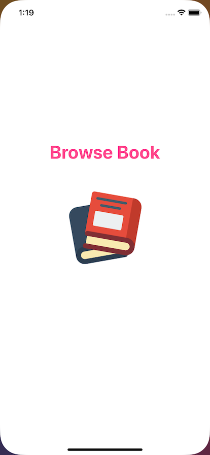
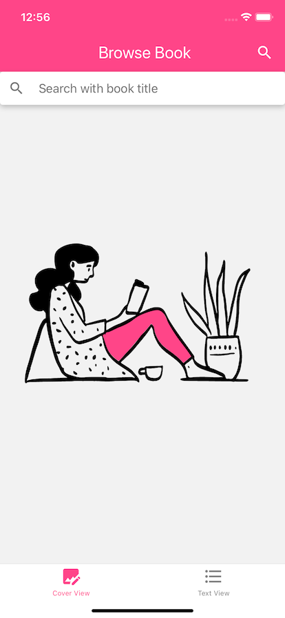
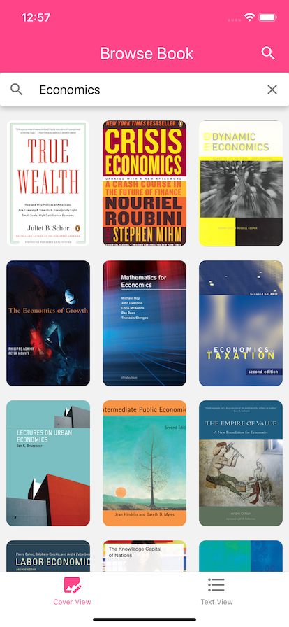
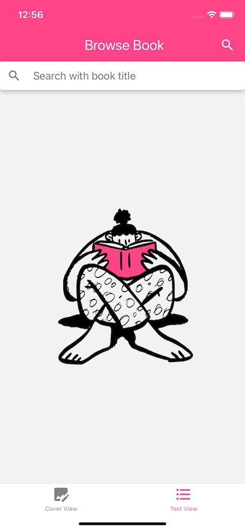
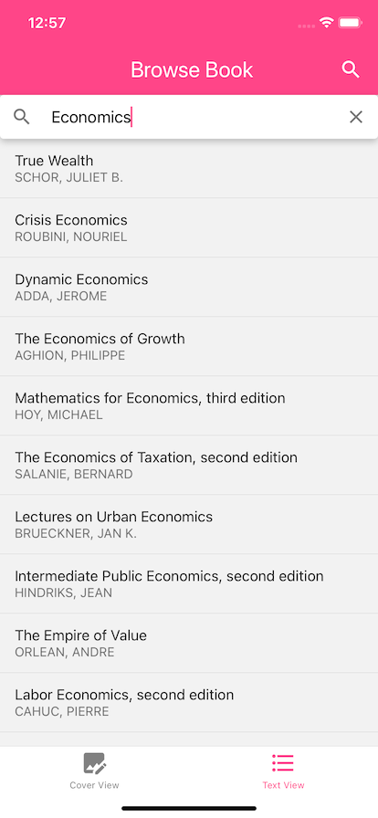
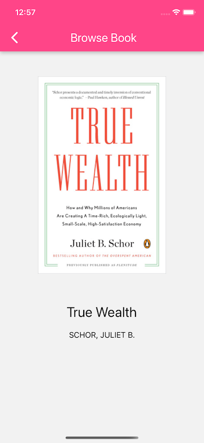
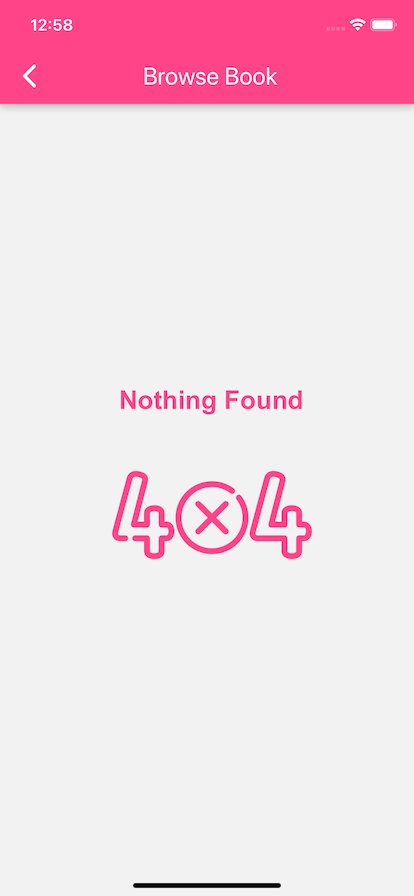
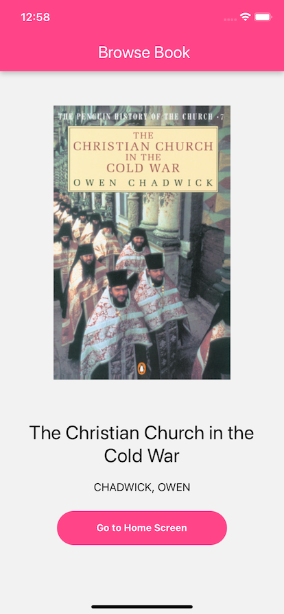

## Get Started

### 1. System Requirements

- Globally installed [node](https://nodejs.org/en/)

- Globally installed [react-native CLI](https://facebook.github.io/react-native/docs/getting-started.html)

### 2. Installation

On the command prompt run the following commands

```sh
$ git clone https://github.com/ahmetgsu/BrowseBook.git

$ cd BrowseBook/

$ npm install
  or
  yarn

$ npx pod-install ios
```

### Run on iOS

- Run `npx react-native run-ios` in your terminal

### ScreenShots

















# Technical assignment mobile engineer

Make an application that allows users to browse book titles. Users should be able to view books in two different ways: text based data or by book cover image.

Your task is to:

- Allow users to switch between two tabs, one with book text data and one with images
- Create a native UI component (Android or iOS) that shows the book covers in a tile view. Caution, the book cover images are oblong (not square) and should not be cropped (but can be resized).
- Users can visit `mwlbooksapp://books/{isbn}` in their browser and within the app, they see the book cover, title, and author's name

We suggest using http://www.penguinrandomhouse.biz/webservices/rest/ as a data source.

**Minimal requirements**

- Use React Native
- Android or iOS for the native UI component
- Use React Navigation or an alternative such as `wix/react-native-navigation`

**Timing**
You have 3 weeks to accomplish the assignment. You decide yourself how much time and effort you invest in it, but one of our colleagues tends to say: "Make sure it is good" ;-).
Please send us an email (jobs@madewithlove.com) when you think the assignment is ready for review. Please mention your name, Github username, and a link to what we need to review.
